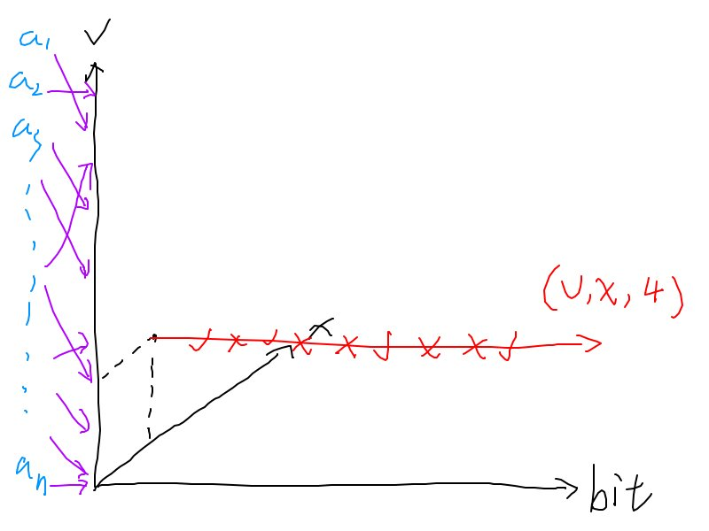
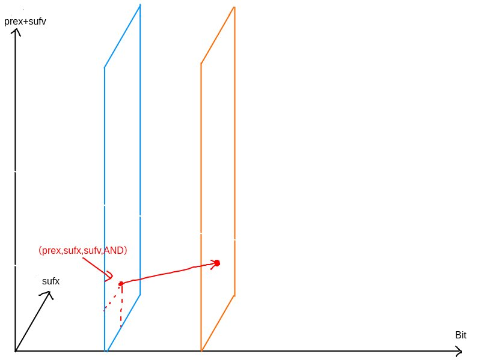
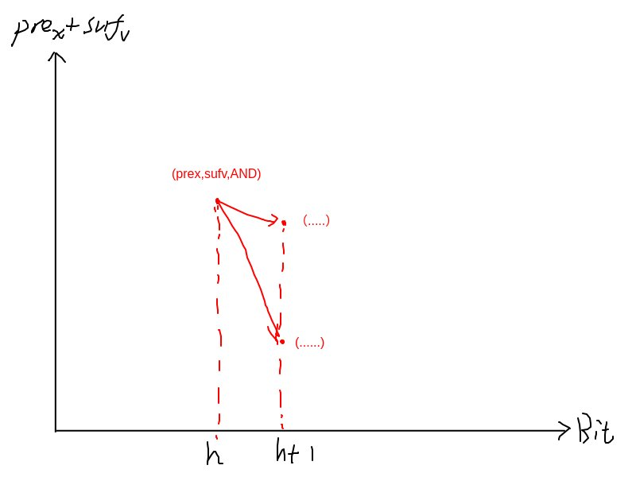

[在 github 阅读](https://github.com/eLecCap1taL/CPP/tree/main/blogs/0609.md) 以查看图片

# NFLS T1

你有一个序列 $a$，长度为 $n$。

有 $q$ 组查询。每组查询包含五个整数 $A, B, C, k, x$。

对于每组查询，你需要构造一个新序列 $b$，其中：

$$
b_i = A \times \text{popcnt}(a_i \,\&\, x) + B \times \text{popcnt}(a_i \,|\, x) + C \times \text{popcnt}(a_i \,\oplus\, x)
$$

即：

* `&` 表示按位与 (AND)
* `|` 表示按位或 (OR)
* `^` 或 `⊕` 表示按位异或 (XOR)
* `popcnt(x)` 表示整数 $x$ 的二进制表示中 1 的个数（即 popcount）

你需要输出序列 $b$ 中的第 $k$ 小的元素。

$n,A,B,C$ 不重要，值域和询问次数都 $\lt 2^{16}$

### 题解

首先立刻注意到异或的 popcount 是假的，可以拆成与和或。变成：
$$
b_i = (A-C) \times \text{popcnt}(a_i \,\&\, x) + (B+C) \times \text{popcnt}(a_i \,|\, x)
$$
询问没有很多，每次询问我们可以枚举与和或的 popcount。于是考虑这个问题：

> 给定数组 $a_i$，多次询问，每次询问给定 $x,P,Q$，要求你求出原数组里有多少 $a_i$ 满足：
> $$
> \text{popcnt}(a_i\,\&\,x)=P\\
> \text{popcnt}(a_i\,\,|\,x)=Q\\
> $$

只要能解决这个，每次询问我们枚举 $16^2$ 之后对权值排序，取前 $k$ 个即可。

朴素做法是遍历 $2^{16}$ 一个一个算，我们有一个高明的多的 DP。

我们数量不多，我们可以处理出答案数组 $ans_{x,P,Q}$。考虑一位一位地处理这个东西。

$f_i,x,P,Q$ 表示考虑了前 $i$ 个二进制位，前 $i-1$ 为原数组值、后 $16-i+1$ 位为输入值，与为 $P$，或为 $Q$ 的原数组值数量。

相当抽象，先看初始化，有 $f_{0,v,0,0}=\sum_{i=1}^n[a_i=v]$ 。

即，最开始，数组里的值就是自己原本的值，呈待处理。

我们要解决的问题是，一开始给你 $A$，多次询问给出 $B,C$，需要求出满足 $A\ \text{opt}\ B=C$ 的 $A$ 的数量

于是这个 DP 的起点就是 $A$，终点就是 $B$，我们在过程中把 $C$ 维护进状态。

对于手头上已有的 $v$（要求 $v$ 这一位为 $0$），若枚举到了第 $i$ 位，直接放代码感觉更直观

```
g[v][AND][OR]+=f[v][AND][OR];
g[v][AND][OR+1]+=f[v|(1<<i)][AND][OR];
g[v|(1<<i)][AND][OR+1]+=f[v][AND][OR];
g[v|(1<<i)][AND+1][OR+1]+=f[v|(1<<i)][AND][OR];
```

就是在枚举这一位的情况。

不妨来考虑一些更本质的东西。为什么这么做能节约复杂度，或者说，为什么要这样做？这样做的动机是什么？

先只关注 AND 的情况。考虑这样的图：



这描述了一个暴力的过程，对于每个 $v$，枚举所有可能的 $x$，一个一个 bit 地判断这一位与是否为 $1$（当然代码里不会体现这一点），记录 popcount，最后穿过去之后变为 $(v,x,popcount)$，这个三元组的权值 $val$ 会被累加给 $(x,popcount)$。

权值是什么呢，容易发现其实已经隐含了一步映射，我们把 $n$ 个 $a_i$ 映射到了更小的值域上，并给每个值赋权了（即在 $a$ 中的出现次数）

我们发现枚举 $(v,x)$ 耗费了大量时间复杂度 $O(V^2)$，但最后我们却不关心 $v$ 的值，这实在太浪费了！

我们希望避免这种浪费，暂时没有什么思路。来仔细推敲一下这根红色运算线。随着 bit 的推进，我们会发现，我们不再关心这个 bit 之前的 $v$ 的具体数值，我们只需要保留这个 bit 前面 $x$ 的数值——毕竟我们最后统计是真的会用到 $x$ 的。

能不能据此改进呢？哪怕一点点也可以。容易想到这个：



AND 的值不在此画出，实际上是另外一个维度，我们也暂时不太关心它

这样确实减少了状态，具有相同的 $(pre_x,suf_x,suf_v,AND)$ 的状态被合并，而它们的 $pre_v$ 我们则不再加以区分。注意到 $pre_x$ 和 $suf_v$ 或 $suf_x$ 一定无交，直接把其中二者合并，我们的状态数还是 $O(V^2)$ 的

但这并没有完全解决我们的问题。你会发现让我们的状态数维持在 $O(V^2)$ 级别的罪魁祸首是 $suf_x$ 和 $suf_v$——我们不得不同时记录它们二者，只有这样才能正确地在后面计算 AND。

然后你会立刻发现这蠢到家了——如果两个状态的 $pre_x$、$suf_v$ 和 $AND$ 都是一样的，那么它们目前的值显然完全一样，$suf_x$ 的影响完全不会体现，因为它在后面才会被考虑！

那我们自然会想去丢掉这个 $suf_x$，会发现很简单，真的直接把它丢掉就行了。我们完全没必要分配 $O(V^2)$ 个起点，只需要分配 $O(V)$ 个起点，在每个 Bit 考虑这一位的 $x$ 是 $0$ 还是 $1$，就可以避免记录 $suf_x$ 了。

当然，对于一个状态，就需要转移到两个状态，代表枚举的 $x$ 是 $0$ 还是 $1$。这是非常合理的。



然后你会发现我们做完了，复杂度对了，和之前描述的做法一模一样。核心在于，对于任何一个 bit，它前面的 $v$ 和它后面的 $x$ 我们都不关心，于是同 bit 状态数变成了 $O(V)$。

如果多维护一个 OR 也是简单的，加个维度多讨论一下就行了，反正这都是省不掉的维度，不用考虑优化，是小问题

多画图讨论一下是极好的啊（赞赏）