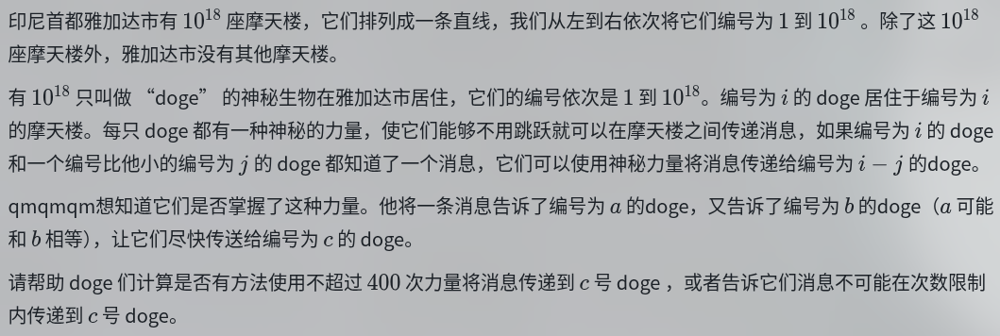

# UOJ216 Jakarta Skyscrapers



### 思考

每个数肯定能写成若干数加起来，再减去若干数

凑二进制？余数？

### 题解

真是二进制，不过有更重要的部分，哎，$\gcd$ 啊

$c$ 不是 $\gcd(a,b)$ 的倍数肯定无解了。考虑先凑出 $g=\gcd(a,b)$ ，再用 $a$ 不断减去 $g$ 得到 $c$，后面这个可以倍增优化

辗转相减太慢了，辗转相除，倍增

```
LL a,b,c;

map<LL,int> mp; 
vector<pair<LL,LL>> ans;
void opt(LL x,LL y){
	if(x<=y){
		cerr<<"Error opt "<<x<<"-"<<y<<endl;
		exit(1);
	}
	if(mp[x]==0){
		cerr<<"Error opt "<<x<<"-"<<y<<", x does not exist!";
		exit(1);
	}
	if(mp[y]==0){
		cerr<<"Error opt "<<x<<"-"<<y<<", y does not exist!";
		exit(1);
	}
	if(mp[x-y]!=0){
		// cerr<<x<<"-"<<y<<" = "<<x-y<<" exists. ignoring......\n";
		return ;
	}
	mp[x-y]=1;
	// cerr<<x<<' '<<y<<endl;
	ans+=mkp(x,y);
}
void finish(){
	if(mp[c]==0){
		cerr<<"c does not exist!\n";
		exit(1);
	}
	cout<<ans.size()<<endl;
	for(auto [x,y]:ans){
		cout<<x<<' '<<y<<'\n';
	}
}

void makedouble(LL x){
	// cerr<<a<<' '<<x<<endl;
	// assert(a-x>=1);
	// assert(a-x*2>=1);
	if(mp[2*x]!=0){
		return ;
	}
	// cerr<<"double "<<x<<endl;
	opt(a,x);
	opt(a-x,x);
	opt(a,a-2*x);
	// cerr<<"double end"<<endl;
}
void decre(LL x,LL y,LL num){
	if(mp[x-y*num]!=0)	return ;
	LL res=y;
	// cerr<<"decre "<<x<<' '<<y<<' '<<num<<endl;
	for(int i=0;i<=61;i++){
		if(num&(1ll<<i)){
			opt(x,res);
			x-=res;
			num-=1ll<<i;
			if(num==0)	break;
		}
		makedouble(res);
		res*=2;
	}
	// while(num--){
		// opt(x,y);
		// x-=y;
	// }
}
void GCD(LL x,LL y){
	if(x<y){
		GCD(y,x);
		return ;
	}
	if(x%y==0){
		return ;
	}
	decre(x,y,x/y);
	GCD(y,x%y);
}

void solve(bool SPE){ 
	cin>>a>>b>>c;
	
	if(a<b)	swap(a,b);
	
	LL g=__gcd(a,b);
	if(c%g!=0 || c>a){
		cout<<"-1";
		return ;
	}
	
	mp[a]=1;
	mp[b]=1;
	
	GCD(a,b);
	
	decre(a,g,(a-c)/g);
	
	// assert(mp[g]!=0);
	
	
	finish();
	return ;
}
```


# UOJ75  【UR #6】智商锁

要求构造一个不超过 $100$ 节点的无向图，满足生成树数量 $\bmod 998244353$ 为 $k$

直接看题解了，感觉困难的，没什么思路

### 题解

果然是神仙题。

我们确有把答案相乘的能力，具体地，如果有两个图 $G_1,G_2$，它们的生成树数量为 $f(G_1)$ 和 $f(G_2)$，那么用一个桥把他们串起来，生成树数量显然就变成 $f(G_1)f(G_2)$ 了。

然后就玄妙起来了，随 $1000$ 个 $12$ 点无向图。$12$ 点完全图的生成树数量是 $12^{10}$，因此把这个 $1000$ 点的生成树数量看作纯随机数

然后我们试图找到一个四元组 $(x,y,z,w)$，满足 $f(G_x)f(G_y)f(G_z)f(G_w)\bmod 998244353=k$。我们可以把所有的四元组再看成 $10^{12}$ 个随机变量，这覆盖的概率就很高了。

这也太厉害了……

``` 
int k;
typedef array<array<int,12>,12> mat;
void gen(mat& a){
	static mt19937 rd(random_device{}());
	
	foru(i,0,11){
		foru(j,0,11){
			a[i][j]=0;
		}
	}
	foru(i,0,11){
		foru(j,i+1,11){
			if(rd()%100<=80 || j==i+1){
				a[i][j]=a[j][i]=mod-1;
				a[i][i]++;
				a[j][j]++;
			}
		}
	}
}
int calc(mat a){
	int ret=1;
	// foru(i,0,11){
		// foru(j,0,11){
			// cout<<a[i][j]<<' ';
		// }
		// HH;
	// }
	foru(i,0,10){
		int mx=INT_MIN,p=0;
		foru(j,i,10){
			if(chkmax(mx,a[j][i]))	p=j;
		}
		swap(a[i],a[p]);
		if(i!=p)	ret=rmv(0,ret);
		
		// assert(a[i][i]!=0);
		// if(a[i][i]==0){
// 			
			// foru(i,0,11){
				// foru(j,0,11){
					// cout<<a[i][j]<<' ';
				// }
				// HH;
			// }
			// exit(0);
		// }
		
		mll(ret,a[i][i]);
		int inv=qpow(a[i][i],mod-2);
		
		foru(j,i+1,10){
			int scale=mul(a[j][i],inv);
			foru(k,i,10){
				mmv(a[j][k],mul(a[i][k],scale));
			}
		}
	}
	// exit(0);
	
	return ret;
}
mat a[1005];
int f[1005];
int _f[1005];
unordered_map<int,pair<int,int>> mp;
void pre(){
	foru(i,1,1000){
		gen(a[i]);
		f[i]=calc(a[i]);
		_f[i]=qpow(f[i],mod-2);
	}
	foru(i,1,1000){
		foru(j,1,1000){
			mp[mul(f[i],f[j])]=mkp(i,j);
		}
	}
	
	// foru(o,1,1000){
		// tr.clear();
		// tr.set(12);
		// foru(u,0,11){
			// foru(v,u+1,11){
				// if(a[o][u][v]!=0){
					// tr.add_edge(u+1,v+1);
				// }
			// }
		// }
		// cout<<tr.calc()<<' '<<f[o]<<endl;
		// assert(tr.calc()==f[o]);
	// }
}

vector<pair<int,int>> ls;
void push(mat& a,int base){
	foru(i,0,11){
		foru(j,i+1,11){
			if(a[i][j]!=0){
				ls+=mkp(base+i,base+j);
			}
		}
	}
}
void finish(){
	// tr.set(48);
	ls+=mkp(1,13);
	ls+=mkp(13,25);
	ls+=mkp(25,37);
	cout<<12*4<<' '<<ls.size()<<'\n';
	for(auto [x,y]:ls){
		// tr.add_edge(x,y);
		cout<<x<<' '<<y<<'\n';
	}
	// cout<<tr.calc()<<endl;
	ls.clear();
}
void solve(bool SPE){ 
	k=RIN;
	
	
	int x=0,y=0,z=0,w=0;
	foru(i,1,1000){
		foru(j,1,1000){
			auto it=mp.find(mul(k,_f[i],_f[j]));
			if(it!=mp.end()){
				x=i,y=j,z=it->se.fi,w=it->se.se;
				goto ok;
			}
		}
	}
	
	ok:
	
	// cout<<mul(f[x],f[y],f[z],f[w])<<endl;
	// cout<<x<<' '<<y<<' '<<z<<' '<<w<<endl;
	
	push(a[x],1);
	push(a[y],13);
	push(a[z],25);
	push(a[w],37);
	
	// tr.clear();
	finish();
	
	return ;
}
```

# P9837 汪了个汪

小 P 喜欢上了一款叫做《汪了个汪》的游戏。这个游戏有一个牌堆和一个金字塔形的棋盘，总共有 $3$ 关。具体地，如图所示，棋盘的边长为 $n$，第 $i$ 行有 $i$ 个格子，共 $\dfrac{n(n+1)}{2}$ 个格子。

牌堆中有 $1, 2 \dots n$ 的数字卡片 **各无穷多张**。你需要将这些数字卡片放到对应的棋盘格子中，每个格子恰好放一张数字卡片，要求满足棋盘的每一行的第一个元素 **互不相同**。

小 P 发现，这个游戏的难度会随着关卡编号而增加：

- 在第 $0$ 关中，你不必满足其他条件。
- 在第 $1$ 关中，你需要保证一行内相邻的两个数互不相同，且所有由任意一行内相邻两个数组成的 **无序二元组** 互不相同。
- 在第 $2$ 关中，你需要满足第 $1$ 关的限制，并且一行内的 **所有数** 必须互不相同。

例如，下面是 $n=5$ 时可以通过第 $2$ 关的摆放方式：


现在给定 $n$ 与关卡编号，请你帮小 P 找出一种合适的摆放方式来通过这一关。可以证明在游戏限制下一定存在一种过关方式。

### 题解

我们需要保证的间隔位置有 $\frac{(n-1)n}{2}$ 个，正好这样的对也只有这么多，也就是需要分配

很容易想到按差分配，但是后面的构造不好想/ng

先考虑把 $1-n$ 放下来

```
1
2
3
4
5
```

然后把差为 $1$ 的摞上去

```
1 2
2 3
3 4
4 5
5
```

再放差为 $2$

```
1 2
2 3 1
3 4 2
4 5 3
5
```

会发现这里有点奇怪，如果 $2$ 直接和 $4$ 匹配的话后面就不够用了，因此往回一下（一点都不好想啊

以此类推，直接就构造玩了

```
1 2
2 3 1 4
3 4 2 5 1
4 5 3
5
```

重排顺序即可

```
int n,t;
vector<int> ls[4005];
void solve(bool SPE){ 
	n=RIN,t=RIN;
	
	int l=1,r=n;
	int L=1,R=n;
	foru(i,1,n){
		if(i>1){
			if(i&1){
				l=ls[L].back()-(i-1);
			}else{
				l=ls[L].back()+i-1;
			}
		}
		r=l+(R-L);
		foru(j,l,r){
			ls[L+j-l]+=j;
		}
		if(i&1){
			R--;
		}else{
			L++;
		}
	}
	
	sort(ls+1,ls+1+n,[](const vector<int>& x,const vector<int>& y)->bool {
		return x.size()<y.size();
	});
	
	foru(i,1,n){
		foru(j,0,i-1){
			cout<<ls[i][j]<<' ';
		}
		cout<<'\n';
	}
	return ;
}
```

# LOJ542 序列划分

有一个长度为 n 的整数序列 $\{a_1, a_2, \cdots, a_n\}$。

你的任务是判断是否可以将其划分为 **k 的倍数个非空子序列**，使得每个元素在恰一个子序列中出现，同时每个子序列均**以 k 的倍数开头、k 的倍数结尾**，并且**长度也为 k 的倍数**。若能划分，求出任意一个方案。

$k,n\le 10^6$

$a_i\le 10^6$

### 思考

$k^2$ 需要不超过 $n$，同时 $n$ 必须是 $k$ 的倍数

可以把所有 $k$ 的倍数标出来，这有什么用吗，没被标记的点必须被划分进某一个里，但又得是 $k$ 的倍数段

神秘

### 题解

以后不管遇到什么题，还是都得想着简化情况，证明一些情况可以被转化啊

这个题可以说明，如果有解，只会选择 $k$ 个子序列，证明很好说，可以把多的轻松合并起来。

而且起点和终点，一定是前 $k$ 个和后 $k$ 个 $k$ 的倍数，否则可以把当前的起点丢掉换成刚才说的

 

这样，先尝试顺序匹配，那么对于 $L_i$ 来说，它得把 $L_{i+1}$ 之前的都取完了，不然就没人管了，再保证不超过 $R_i$。一取就得取 $k$ 个。

如果顺序匹配爆了，那么我们让 $L_i$ 匹配 $R_{i-1}$，这次每两个之间只取 $k-2$ 个就行了，需求比上次更宽松，最后让 $L_1$ 和 $R_k$ 兜底即可。

如果这样还爆了，继续向右 shift 毫无意义，因为那样限制只会更紧

```
int n,k;
int a[MAXN];
int L[MAXN];
int R[MAXN];
int s[MAXN];

void try1(){
	int us=0;
	foru(i,1,k-1){
		us+=k-2;
		while(us<s[L[i+1]])	us+=k;
		if(us>s[R[i]])	return ;
	}
	cout<<"Yes\n";
	
	us=0;
	static stack<int> st;
	ford(i,n,1){
		if(s[i]!=s[i-1])	st.push(i);
	}
	
	cout<<k<<'\n';
	foru(i,1,k-1){
		static vector<int> ls;
		ls+=L[i];
		us+=k-2;
		foru(o,1,k-2)	ls+=st.top(),st.pop();
		while(us<s[L[i+1]]){
			us+=k;
			foru(o,1,k)	ls+=st.top(),st.pop();
		}
		ls+=R[i];
		
		cout<<ls.size()<<' ';
		for(auto x:ls)	cout<<x<<' ';
		cout<<'\n';
		
		ls.clear();
	}
	cout<<st.size()+2<<' ';
	cout<<L[k]<<' ';
	while(!st.empty()){
		cout<<st.top()<<' ';
		st.pop();
	}
	cout<<R[k];
	
	
	exit(0);
}

void try2(){
	int us=0;
	foru(i,2,k){
		chkmax(us,s[L[i]]);
		us+=k-2;
		if(us>s[R[i-1]])	return ;
	}
	cout<<"Yes\n";
	
	us=0;
	static stack<int> st;
	ford(i,n,1){
		if(s[i]!=s[i-1])	st.push(i);
	}
	
	vector<int> fls;
	fls+=L[1];
	
	cout<<k<<'\n';
	foru(i,2,k){
		static vector<int> ls;
		ls+=L[i];
		
		while(st.top()<L[i]){
			fls+=st.top();
			st.pop();
		}
		
		foru(o,1,k-2){
			ls+=st.top();
			st.pop();
		}
		
		ls+=R[i-1];
		
		cout<<ls.size()<<' ';
		for(auto x:ls)	cout<<x<<' ';
		cout<<'\n';
		
		ls.clear();
	}
	while(!st.empty()){
		fls+=st.top();
		st.pop();
	}
	fls+=R[k];
	cout<<fls.size()<<' ';
	for(auto x:fls)	cout<<x<<' ';
	
	
	exit(0);
}

void solve(bool SPE){ 
	RIN;
	
	n=RIN,k=RIN;
	foru(i,1,n){
		a[i]=RIN;
		a[i]=a[i]%k!=0;
	}
	
	if(n%k!=0 || (LL)k*k>n || a[1] || a[n]){
		cout<<"No";
		return ;
	}
	
	int N=0;
	foru(i,1,n){
		if(a[i]==0)	L[++N]=i;
	}
	
	N=0;
	ford(i,n,1){
		if(a[i]==0)	R[++N]=i;
	}
	
	if(N<k){
		cout<<"No";
		return ;
	}
	
	reverse(R+1,R+1+k);
	
	if(L[k]>=R[1]){
		cout<<"No";
		return ;
	}
	
	foru(i,1,k){
		s[L[i]]=s[R[i]]=1;
	}
	foru(i,1,n){
		s[i]=s[i-1]+(s[i]==0);
	}
	
	try1();
	try2();
	
	cout<<"No";
	
	
	
	return ;
}
```


# P10441 [JOISC 2024] 乒乓球

在 JOI 王国举办了一场乒乓球比赛。 $N$ 只编号从 $1$ 到 $N$ 的海狸参加了这场比赛，并进行了一场循环赛。

你从 Bitaro 那里得知了关于比赛结果的以下信息。

-  没有平局比赛。
- 正好有 $M$ 种选择 $3$ 只海狸形成“三元悖论”。请注意，只有当以下两个条件之一恰好满足时，$3$ 只海狸 $i, j, k$（$1 \leq i < j < k \leq N$）才形成“三元悖论”。
- - 海狸 $i$ 击败了海狸 $j$，海狸 $j$ 击败了海狸 $k$，海狸 $k$ 又击败了海狸 $i$。
- - 海狸 $i$ 击败了海狸 $k$，海狸 $k$ 击败了海狸 $j$，海狸 $j$ 又击败了海狸 $i$。

你不确定 Bitaro 提供的信息是否正确，所以你决定思考是否有任何与 Bitaro 提供的信息相符的比赛结果。编写一个程序，根据 Bitaro 提供的信息判断是否有任何比赛结果与信息相符，如果有，找出其中任意一种比赛结果。=

- $1 \leq Q$．
- $3 \leq N \leq 5000$．
- $0 \leq M \leq \frac{1}{6} N(N - 1)(N - 2)$．
- $Q$ 个场景中 $N$ 的总和不超过 5000
- 给定值均为整数。

### 题解

即要求构造一个 $n$ 个点的竞赛图，三元环数量为 $M$

哎，结论

首先三元环个数只和入度（出度也无所谓，全翻转罢了）有关
$$
ans={n\choose 3}-\sum_{i=1}^n{deg_i\choose 2}
$$
总数减去不合法的，每个不合法的 "三元环" 肯定会这样被统计一次

这个 $ans$ 最大是好取的，猜或者证都可以，$deg$ 全取半就行。如果 $n$ 是偶数就有一半取 $\frac{n}{2}-1$。

然后你发现根据这个式子，如果有俩 $deg$ 相同的点 $u,v$，把连接他俩之间的边翻转，一个 $deg+1$ 一个 $-1$，然后刚好三元环数减一

于是只要搞一个拉满的图减就行了。找一个最小的 $N$ 满足 $N$ 的最大三元环数超过 $M$，然后减就行了。$[N+1,n]$ 的部分可以无脑 DAG

减的次数是 $O(n^2)$ 的，因为最大三元环数的增量是 $O(n^2)$ 的，而我们找的是最小的 $N$ 满足超过 $M$ 的，所以直接做就可以。随便可以做 $O(n^2\log n)$ 或者不带 $\log$

```
LL C2(LL n){
	return n*(n-1)/2;
}
LL C3(LL n){
	return n*(n-1)*(n-2)/6;
}
LL f[5005];
LL n,m;

bitset<5005> g[5005];


void solve(bool SPE){
	cin>>n>>m;
	int N=3;
	while(f[N]<m)	N++;
	// cout<<N<<'\n';
	// exit(0);
	
	foru(i,1,n){
		foru(j,1,i-1){
			g[i][j]=0;
		}
	}
	
	if(N>n){
		cout<<"No\n";
		return ;
	}
	
	static pair<int,int> d[5005];
	if(N&1){
		foru(i,1,N){
			d[i]=mkp(N/2,i);
		}
	}else{
		foru(i,1,N/2){
			d[i]=mkp(N/2-1,i);
			d[i+N/2]=mkp(N/2,i+N/2);
		}
	}
	
	foru(i,1,N-1){
		sort(d+i,d+1+N);
		// foru(j,1,N){
			// cout<<d[j].fi<<"("<<d[j].se<<")";
		// }
		// HH;
		foru(j,i+1,N){
			int u=d[i].se;
			int v=d[j].se;
			if(d[i].fi){
				d[i].fi--;
				// cout<<v<<" to "<<u<<endl;
				g[v][u]=1;
			}else{
				d[j].fi--;
				// cout<<u<<" to "<<v<<endl;
				g[u][v]=1;
			}
		}
	}
	
	if(N&1){
		foru(i,1,N){
			d[i]=mkp(N/2,i);
		}
	}else{
		foru(i,1,N/2){
			d[i]=mkp(N/2-1,i);
			d[i+N/2]=mkp(N/2,i+N/2);
		}
	}
	
	static unordered_set<int> st[5005];
	foru(i,0,N-1){
		st[i].clear();
	}
	foru(i,1,N){
		st[d[i].fi]+=i;
	}
	static unordered_set<int> bg;
	bg.clear();
	foru(i,1,N-2){
		if(st[i].size()>1)	bg+=i;
	}
	
	// cout<<f[N]-m<<endl;
	// exit(0);
	foru(i,1,f[N]-m){
		auto sz=*bg.begin();
		
		int u=*st[sz].begin();
		st[sz].erase(st[sz].begin());
		
		int v=*st[sz].begin();
		st[sz].erase(st[sz].begin());
		
		if((int)st[sz].size()<=1)	bg.erase(bg.begin());
		
		if(u>v)	swap(u,v);
		
		int res=1;
		if(g[v][u])	res*=-1;
		
		
		d[u].fi+=res;
		d[v].fi-=res;
		
		st[d[u].fi]+=u;
		st[d[v].fi]+=v;
		
		if((int)st[d[u].fi].size()==2 && d[u].fi!=0 && d[u].fi!=N-1)	bg+=d[u].fi;
		if((int)st[d[v].fi].size()==2 && d[v].fi!=0 && d[v].fi!=N-1)	bg+=d[v].fi;
		
		
		// cerr<<"flip "<<v<<' '<<u<<endl;
		g[v][u]=!g[v][u];
	}
	
	// static int D[5005];
	// LL ans=C3(n);
	// foru(i,1,n){
		// D[i]=0;
	// }
	// foru(i,1,n){
		// foru(j,1,i-1){
			// if(g[i][j]){
				// D[i]++;
			// }else{
				// D[j]++;
			// }
		// }
	// }
	// foru(i,1,n){
		// // cout<<D[i]<<' ';
		// ans-=C2(D[i]);
	// }
	// cout<<endl;
	
	
	cout<<"Yes";
	foru(i,1,n){
		foru(j,1,i-1){
			cout<<g[i][j];
		}
		cout<<'\n';
	}
	
	// if(ans!=m){
		// cerr<<n<<' '<<m<<endl;
		// cerr<<ans<<' '<<m<<endl;
		// exit(1);
	// }
	
	return ;
}
```

# ARC132_E

有$n$个正方形排成一行。每个正方形都有一个左指向或右指向的脚印，或是一个洞。每个正方形的初始状态由一个由`。`、`<`、`>`组成的字符串$s$描述。如果$s$的第$i$个字符是`.`，则从左边数第$i$个正方形有一个洞；如果该字符是`<`，那个正方形有一个左指向脚印；如果该字符是`>`，那个正方形有一个右指向脚印。

猫Snuke将重复以下过程，直到没有带有洞的正方形。

-   第$1$步：随机选择一个带有洞的正方形，概率相同。
-   第$2$步：填补选定正方形中的洞，站在那里，并随机地向左或向右，概率相同。
-   第$3$步：继续沿着Snuke朝向的方向行走，直到他踩在一个带有洞的正方形上，或者走出正方形的行。

在这里，正方形和方向的选择是彼此独立的。

当Snuke踩在一个正方形上（没有洞时），该正方形将得到一个沿着他行走方向的脚印。如果正方形已经有脚印，则该脚印将被擦除并替换为新的脚印。例如，在情况`>.<><.><`中，如果Snuke选择从左边数第$6$个正方形并向左，第$6$、$5$、$4$、$3$个正方形将得到左指向的脚印：`>.<<<<><`。

找到Snuke完成过程时左指向脚印的期望值，取模$998244353$。

$n\leq 10^5$

### 思考

这个期望是假的，可以变成计数所有情况下左脚印的和

每一段应该是相对整体的，毕竟一走全都会走过去

对一个单独的段考虑

他两侧每次和它无遮拦（中间没洞）的过程，才会对他有影响

或者说对每一个位置独立考虑？考虑在多少种情况下它最后为左脚印。先假设这个位置一开始不是洞好了

是不是应该尝试给出一个更为形式化的判定？

### 题解

？

不是，这么，利害

考虑最终形态，一定是 <<<<<<<<<<<<<<<<<<<<<<?????????????\>>>>>>>>>>>>>>>>>>>

即，中间一段原序列，两侧分别去向两边。并且原序列的端点外一个必然是初始的洞

证明很简单，不可能覆盖到所有地方。每个洞只能“认领”一段，而一共有 $n$ 个洞的话就会有 $n+1$ 段。

然后两边自然也不可能出现两种方向对装，手玩一下就可以了，和很好理解

于是，可以枚举原序列不变的段。注意到，左右两侧的相对顺序不重要，侧内的顺序才重要，因此如果我们能求出 "左侧变成全左，且不影响右侧" 的概率（右侧同理），就做完了

然后你考虑这个东西，设前 $f_i$ 表示前面 $i$ 个洞，上述问题的概率。最后一个洞的向右操作是不行的，剩下的都无所谓，直接变成子问题了，$f_i=f_{i-1}(1-\frac{1}{2n})$。右侧其实不用倒着 DP 什么的，这个和形态无关，方向左右完全对称，只和洞的数量有关的

不是这个也太厉害了

>  考虑最终形态有时候很简单。一味思考过程可能会让问题复杂化

```
int n;
int a[MAXN];
int s[MAXN];
void solve(bool SPE){ 
	n=RIN;
	foru(i,1,n){
		char c=RCIN;
		switch(c){
			case '<':
				a[i]=1;
				break;
			case '>':
				a[i]=0;
				break;
			case '.':
				a[i]=2;
				break;
		}
	}
	foru(i,1,n+1){
		s[i]=s[i-1]+(a[i]==1);
	}
	int N=0;
	static int p[MAXN];
	foru(i,1,n){
		if(a[i]==2){
			p[++N]=i;
		}
	}
	p[0]=0;
	p[N+1]=n+1;
	
	static int f[MAXN];
	f[0]=1;
	foru(i,1,N){
		f[i]=mul(f[i-1],rmv(1,qpow(2*i,mod-2)));
	}
	
	
	int ans=0;
	
	int lf=0;
	int rf=N;
	foru(i,0,N){
		int num=p[i]+s[p[i+1]]-s[p[i]];
			
		// cout<<lf<<' '<<rf<<endl;
		// cout<<s[p[i+1]]-s[p[i]]<<endl;
		// cout<<num<<' '<<f[lf]<<' '<<f[rf]<<endl;
		mdd(ans,mul(num,f[lf],f[rf]));
		// exit(0);
		lf++,rf--;
	}
	
	cout<<ans;
	
	
	return ;
}
```

