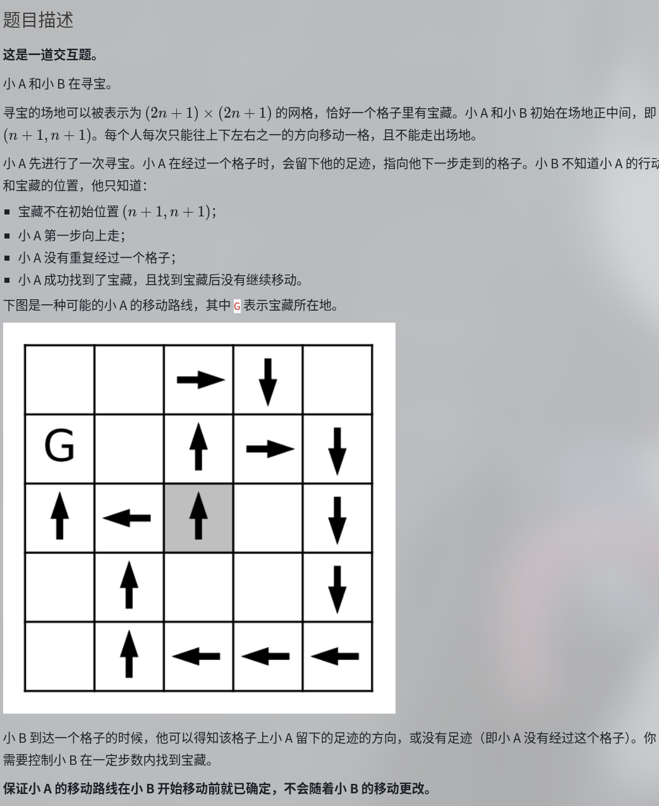

# NFLS T1

神人题



$n=2000$，要求操作次数 $L<30000$

直接对一个方向二分，可以做到 $O(n\log n)$，复杂度正确简单，但是要卡长度

一个很自然的想法是横竖轮流二分，但你会发现只凭借二分边界上的信息没法判断宝藏在哪边

为此考虑利用之前的信息。把整个图分成三部分，当前区域的两部分（被二分边界分开的）和当前区域外的部分，把这三个区域看成三个点，问出来它们之间所有的有向边，判断欧拉回路 / 欧拉路径，即可知道宝藏的位置

考虑这样做的开销，实际上只有内部二分边界的查询才会真正走过去，和外部区域的查询，可以缓存下来之前已经走过位置的信息

“精细实现” 一下就能过了

那很精细了哥们

```
#include "treasure.h"
#define UP '^'
#define DOWN 'v'
#define RIGHT '>'
#define LEFT '<'

struct ExitForFoundTreasure{};

int X,Y;
char C;

char dat[5005][5005];

int cnt=0;
char Walk(char c){
	C=walk(c);
	cnt++;
	switch(c){
		case UP:
			X--;
			break;
		case DOWN:
			X++;
			break;
		case RIGHT:
			Y++;
			break;
		case LEFT:
			Y--;
			break;
	}
	if(C=='G')	throw ExitForFoundTreasure();
	dat[X][Y]=C;
	return C;
}


class Node{
public:
	int a,b,c,d;
	Node(int a=0,int b=0,int c=0,int d=0):a(a),b(b),c(c),d(d){}
	Node operator + (const Node& x)const{
		return Node(a+x.a,b+x.b,c+x.c,d+x.d);
	}
	Node& operator +=(const Node& x){
		*this=(*this)+x;
		return *this;
	}
	Node& operator +=(const char& x){
		switch(x){
			case UP:
				a++;break;
			case DOWN:
				b++;break;
			case RIGHT:
				c++;break;
			case LEFT:
				d++;break;
			case '.':
				break;
			case 'e':
				break;
			default:
				throw runtime_error("InvalidNodeChar");
		}
		return *this;
	}
	int& operator [] (const char& x){
		switch(x){
			case UP:
				return a;
			case DOWN:
				return b;
			case RIGHT:
				return c;
			case LEFT:
				return d;
		}
		throw runtime_error("InvalidNodeChar");
	}
};

void clear(){
	cnt=0;
}
void out(const string& msg=""){
	cerr<<"[cnt"<<msg<<"] "<<cnt<<endl;
}
int n;

void access_x(int x,int y){
	if(dat[x][y]!='e')	return ;
	while(X<x)	Walk(DOWN);
	while(X>x)	Walk(UP);
	while(Y>y)	Walk(LEFT);
	while(Y<y)	Walk(RIGHT);
}
void access_y(int x,int y){
	if(dat[x][y]!='e')	return ;
	while(Y>y)	Walk(LEFT);
	while(Y<y)	Walk(RIGHT);
	while(X<x)	Walk(DOWN);
	while(X>x)	Walk(UP);
}
// auto access=access_x;


void access_line_x(int x,int l,int r){
	if(abs(Y-l)<abs(Y-r)){
		foru(i,l,r){
			access_x(x,i);
		}
	}else{
		ford(i,r,l){
			access_x(x,i);
		}
	}
}
void smart_access_line_x(int x,int l,int r){
	access_x(x,Y);
	int bg=min(max(Y,l),r);
	access_x(x,l);
	access_x(x-1,r);
	access_x(x,bg);
}
void access_line_y(int y,int l,int r){
	if(abs(X-l)<abs(X-r)){
		foru(i,l,r){
			access_y(i,y);
		}
	}else{
		ford(i,r,l){
			access_y(i,y);
		}
	}
}

Node qry_line_x(int x,int l,int r){
	// cerr<<X<<' '<<Y<<endl;
	access_line_x(x,l,r);
	// out();
	// cerr<<X<<' '<<Y<<endl;
	Node ret;
	foru(i,l,r)	ret+=dat[x][i];
	return ret;
}
Node qry_line_y(int y,int l,int r){
	access_line_y(y,l,r);
	Node ret;
	foru(i,l,r)	ret+=dat[i][y];
	return ret;
}

pair<int,int> borderpair_x(int x,int l,int r){
	// cerr<<" "<<X<<' '<<Y<<endl;
	// access_x(x,l);
	// out();
	// cerr<<" "<<X<<' '<<Y<<endl;
	// cerr<<x<<' '<<l<<' '<<r<<endl;
	return mkp(qry_line_x(x,l,r)[UP],qry_line_x(x-1,l,r)[DOWN]);
}

void border_x(int x,int l,int r,int& down_i,int& down_o,int& up_i,int& up_o){
	//[x,l,r] is the line lower
	if(x<=1 || x>=2*n+2)	return ;

	smart_access_line_x(x,l,r);
	auto res=borderpair_x(x,l,r);
	// out();
	down_o+=res.fi,up_i+=res.fi;
	down_i+=res.se,up_o+=res.se;
}
void border_y(int y,int l,int r,int& left_i,int& left_o,int& right_i,int& right_o){
	//[y,l,r] is the line on the left
	if(y<=0 || y>=2*n+1)	return ;

	Node res;
	res=qry_line_y(y,l,r);
	left_o+=res[RIGHT],right_i+=res[RIGHT];
	res=qry_line_y(y+1,l,r);
	left_i+=res[LEFT],right_o+=res[LEFT];
}


void solve(int xl,int xr,int yl,int yr){
	if(xl==xr)	return access_line_x(xl,yl,yr);
	if(yl==yr)	return access_line_y(yl,xl,xr);
	if(xl>xr)	throw runtime_error("Invalid solve x-region");
	if(yl>yr)	throw runtime_error("Invalid solve y-region");
	if(xr-xl<yr-yl){
		int mid=(yl+yr)>>1;

		int L_i=0;
		int L_o=0;
		int R_i=0;
		int R_o=0;
		int X_i=0;
		int X_o=0;

		clear();
		border_y(mid,xl,xr,L_i,L_o,R_i,R_o);
		out("by");
		// exit(1);
		clear();
		border_y(yl-1,xl,xr,X_i,X_o,L_i,L_o);
		border_y(yr,xl,xr,R_i,R_o,X_i,X_o);

		border_x(xl,yl,mid,L_i,L_o,X_i,X_o);
		border_x(xl,mid+1,yr,R_i,R_o,X_i,X_o);
		border_x(xr+1,yl,mid,X_i,X_o,L_i,L_o);
		border_x(xr+1,mid+1,yr,X_i,X_o,R_i,R_o);
		// out();

		int L=L_o-L_i;
		int R=R_o-R_i;
		int X=X_o-X_i;

		int chk=(L!=0)+(R!=0)+(X!=0);
		
		if(chk!=0 && chk!=2)	throw runtime_error("Invalid Graph degrees (1)");
		
		if(L==0 && R==0 && X==0){
			if(n+1<xl || n+1>xr || n+1<yl || n+1>yr)	throw runtime_error("expect (n+1,n+1) in solve region, but not found");
			if(n+1<=mid)	solve(xl,xr,yl,mid);
			else	solve(xl,xr,mid+1,yr);
			return ;
		}

		if(min({L,R,X})!=-1 || max({L,R,X})!=1)	throw runtime_error("Invalid Graph degrees(2)");
		if(X==-1)	throw runtime_error("-1 should be in the region");

		if(L==-1)	solve(xl,xr,yl,mid);
		else	solve(xl,xr,mid+1,yr);
	}else{
		int mid=(xl+xr)>>1;

		int U_i=0;
		int U_o=0;
		int D_i=0;
		int D_o=0;
		int X_i=0;
		int X_o=0;

		clear();
		border_x(mid+1,yl,yr,D_i,D_o,U_i,U_o);
		out("bx");
		clear();
		border_x(xl,yl,yr,U_i,U_o,X_i,X_o);
		border_x(xr+1,yl,yr,X_i,X_o,D_i,D_o);

		border_y(yl-1,xl,mid,X_i,X_o,U_i,U_o);
		border_y(yl-1,mid+1,xr,X_i,X_o,D_i,D_o);
		border_y(yr,xl,mid,U_i,U_o,X_i,X_o);
		border_y(yr,mid+1,xr,D_i,D_o,X_i,X_o);
		// out();

		int U=U_o-U_i;
		int D=D_o-D_i;
		int X=X_o-X_i;

		int chk=(U!=0)+(D!=0)+(X!=0);
		
		if(chk!=0 && chk!=2)	throw runtime_error("Invalid Graph degrees (1)");
		
		if(U==0 && D==0 && X==0){
			if(n+1<xl || n+1>xr || n+1<yl || n+1>yr)	throw runtime_error("expect (n+1,n+1) in solve region, but not found");
			if(n+1<=mid)	solve(xl,mid,yl,yr);
			else	solve(mid+1,xr,yl,yr);
			return ;
		}

		if(min({U,D,X})!=-1 || max({U,D,X})!=1)	throw runtime_error("Invalid Graph degrees(2)");
		if(X==-1)	throw runtime_error("-1 should be in the region");

		if(U==-1)	solve(xl,mid,yl,yr);
		else	solve(mid+1,xr,yl,yr);
	}
}

void init(){
	const int NL=1;
	const int NMID=n+1;
	const int NR=2*n+1;

	foru(i,NL,NR)	foru(j,NL,NR)	dat[i][j]='e';

	X=NMID,Y=NMID;
	dat[X][Y]=UP;
	
	int U_i=0;
	int U_o=0;
	int D_i=0;
	int D_o=0;

	smart_access_line_x(NMID+1,NL,NR);
	border_x(NMID+1,NL,NR,D_i,D_o,U_i,U_o);
	out();
	// exit(1);

	if(U_o==D_o){
		solve(NL,NMID,NL,NR);
	}else if(U_o==D_o+1){
		solve(NMID+1,NR,NL,NR);
	}else{
		throw runtime_error("Unexpect Init Status");
	}

	throw runtime_error("init didn't find treasure");
}
void find_treasure(int _n){
	n=_n;
	try{
		init();
	}catch(ExitForFoundTreasure){
		return ;
	}catch(const runtime_error& e){
		cerr<<"Error: "<<e.what()<<endl;
		exit(1);
		return ;
	}
}
```

---

这次琢磨出来的一个小技巧

如果做这种交互题，很可能会出现，我需要退出我这个 `find_treasure` 函数。如果每层调用都判个全局 flag 太烂，如果直接 exit 那连交互库也直接退出了会炸。

这种时候可以用一个 `try{}catch(ERROR){}` 把自己的代码罩住，如果需要返回就抛出一个自己定义的特殊异常即可。调试也好用，随手抛一个 `std::runtime_error`，省去了打 cerr 或者 exit 的麻烦，还能附加信息

# NFLS T2

给一个网格图,要求取出个生成树,满足叶子之间距离都是偶数


网格图,不得不品的一环就是黑白染色,转二分图

吃了多少次亏了都,不是哥们,还想不起来黑白染色吗?

然后就是一些简单讨论了,限制变成叶子必须在一边


ISAP 跑二分图匹配怎么这么慢	

```
template<int N,int M,class D,D INF>
class ISAP{
	struct edge{
		int v;
		int nxt;
		D w;
	}e[M*2+5];
	int ecnt=1;
	int head[N+5],cur[N+5],dep[N+5],gap[N+5];
	int n,s,t;

	void add_e(int u,int v,D w){
		e[++ecnt]={v,head[u],w};
		head[u]=ecnt;
	}

	bool bfs(){
		static queue<int> q;
		memset(dep,-1,sizeof dep);
		memcpy(cur,head,sizeof head);
		dep[s]=0;
		q.push(s);
		while(!q.empty()){
			int u=q.front();
			q.pop();
			for(int i=head[u];i;i=e[i].nxt){
				int v=e[i].v;
				if(dep[v]!=-1 || e[i].w==0)	continue;
				dep[v]=dep[u]+1;
				q.push(v);
			}
		}
		return (dep[t]!=-1);
	}
	D dfs(int u,D flow){
		if(u==t)	return flow;
		D used=0;
		for(int &i=cur[u];i;i=e[i].nxt){
			int v=e[i].v;
			if(e[i].w==0 || dep[u]!=dep[v]-1)	continue;
			D x=dfs(v,min(flow-used,e[i].w));
			e[i].w-=x;
			e[i^1].w+=x;
			used+=x;
			assert(flow>=0);
			assert(used<=flow);
			// if(used==flow)	return used;
		}
		return used;
	}
public:
	void clear(){
		foru(i,1,n)	head[i]=dep[i]=gap[i]=0;
		n=s=t=0;
		ecnt=1;
	}
	void set(int _n,int _s,int _t){
		n=_n,s=_s,t=_t;
	}
	int add_edge(int u,int v,D w){
		add_e(u,v,w);
		add_e(v,u,0);
		return ecnt-1;
	}
	int S(){return s;}
	int T(){return t;}
	D qry_w(int id)const{
		return e[id].w;
	}
	D maxflow(){
		D flow=0;
		while(bfs()){
			flow+=dfs(s,INF);
			// cerr<<flow<<endl;
		}
		return flow;
	}
};

int n,m;

string s[1005];

int N,M;
pair<int,int> lf[405*405];
pair<int,int> rf[405*405];
vector<int> el[405*405];
vector<int> el_id[405*405];
vector<int> er[405*405];

const int dx[4]={-1,1,0,0};
const int dy[4]={0,0,1,-1};

int id[405][405];

ISAP<405*405,405*405*3,int,INT_MAX> g;

void solve(bool SPE){
	
	g.set(3,1,3);
	g.add_edge(1,2,1);
	g.add_edge(2,3,2);

	cerr<<g.maxflow();
	
	exit(0);
	n=RIN,m=RIN;

	// if(n>20)	return ;
	if(n==1 && m==1){
		cout<<"Yes\n###\n#.#\n###";
		return ;
	}

	foru(i,1,2*n+1){
		s[i]=" "+RSIN;
	}

	foru(i,1,n){
		foru(j,1,m){
			if(s[2*i][2*j]=='#'){
				continue;
			}
			if((i+j)&1){
				N++;
				lf[N]={i,j};
				id[i][j]=N;
			}else{
				M++;
				rf[M]={i,j};
				id[i][j]=M;
			}
		}
	}
	foru(i,1,n){
		foru(j,1,m){
			if(s[2*i][2*j]=='#'){
				continue;
			}
			auto& e=((i+j)&1)?el[id[i][j]]:er[id[i][j]];
			for(int k=0;k<4;k++){
				int u=i+dx[k],v=j+dy[k];
				if(id[u][v]==0)	continue;
				if(s[i*2+dx[k]][2*j+dy[k]]=='#')	continue;
				e+=id[u][v];
			}
		}
	}

	cerr<<N<<' '<<M<<endl;
	cerr<<N+M<<endl;
	cerr<<n*m<<endl;

	// foru(i,1,M){
	// 	cein<<rf[i]<<endl;
	// }
	if(N>M){
		foru(i,1,N){
			swap(el[i],er[i]);
			swap(lf[i],rf[i]);
		}
		swap(N,M);
		// exit(1);
	}

	if(N==M){
		cout<<"No";
		return ;
	}

	g.set(N+M+2,N+M+1,N+M+2);

	// cerr<<N<<' '<<M<<endl;
	
	int ct=0;
	// map<int,int> mp;
	foru(u,1,N){
		el_id[u].resize(el[u].size(),0);
		// cerr<<el[u].size()<<endl;
		// mp[sz(el[u])]++;
		for(int i=0;i<sz(el[u]);i++){
			int v=el[u][i];
			el_id[u][i]=g.add_edge(u,N+v,1);
			ct++;
		}
	}
	// for(auto [X,Y]:mp){
	// 	cerr<<X<<'~'<<Y<<endl;
	// }
	foru(u,1,N)	g.add_edge(g.S(),u,1),ct++;
	foru(u,1,M)	g.add_edge(u+N,g.T(),1),ct++;
	// cerr<<ct<<endl;

	// exit(0);
	LL mxflow=g.maxflow();
	// cerr<<mxflow<<endl;
	// exit(0);
	// cerr<<mxflow<<endl;
	if(mxflow!=N){
		cout<<"No";
		return ;
	}
	// cerr<<"OK";

	// cerr<<mxflow<<endl;
	static int match[405*405];
	static int matched[405*405];

	foru(u,1,N){
		for(int i=0;i<sz(el[u]);i++){
			int v=el[u][i];
			// cerr<<el_id[u][i]<<endl;
			// cerr<<' '<<g.qry_w(el_id[u][i])<<endl;
			if(g.qry_w(el_id[u][i])==0){
				match[u]=v;
				matched[v]=u;
				// cerr<<u<<' '<<v<<endl;
				break;
			}
		}
	}
	// vector<int> chk;
	// foru(u,1,N){
	// 	chk+=match[u];
	// }
	// sort(All(chk));
	// for(int i=1;i<sz(chk);i++){
	// 	assert(chk[i]!=chk[i-1]);
	// }

	static string os[1005];
	foru(i,1,2*n+1){
		os[i]=" ";
		foru(j,1,2*m+1)	os[i]+='#';
	}
	
	
	static int fa[405*405*2];
	foru(i,1,N+M){
		fa[i]=i;
	}
	auto find=[](auto& find,int x)->int {
		return fa[x]==x?x:fa[x]=find(find,fa[x]);
	};
	auto Union=[&find](int x,int y,int sta=3)->void {
		x=find(find,x),y=find(find,y);
		// assert(x!=y);
		if(x==y)	exit(sta);
		fa[x]=y;
	};

	auto con=[](pair<int,int> x,pair<int,int> y)->void {
		// cein<<x<<' '<<y<<endl;
		if(x>y)	swap(x,y);
		os[2*x.fi][2*x.se]='.';
		os[2*y.fi][2*y.se]='.';
		if(x.fi==y.fi){
			// assert(y.se-x.se==1);
			os[2*x.fi][2*x.se+1]='.';
		}else if(x.se==y.se){
			// assert(y.fi-x.fi==1);
			os[2*x.fi+1][2*x.se]='.';
		}else{
			// assert(0);
		}
	};

	// cerr<<M<<endl;
	static bitset<405*405> vis;

	static queue<int> q;
	foru(i,1,M){
		// cein<<rf[i]<<endl;
		if(matched[i])	continue;
		q.push(i);
	}

	while(!q.empty()){
		int u=q.front();
		q.pop();
		for(auto v:er[u]){
			if(vis[v])	continue;
			if(v==matched[u])	continue;
			vis[v]=1;
			// if(u==match[v])	exit(11);
			// if(find(find,N+u)==find(find,N+match[v]))	exit(12);
			Union(v,N+match[v],1);
			Union(v,N+u,2);
			con(lf[v],rf[u]);
			con(lf[v],rf[match[v]]);
			q.push(match[v]);
		}
	}

	int num=0;
	foru(i,1,N)	num+=vis[i];
	if(num!=N){
		cout<<"No";
		return ;
	}

	foru(v,1,M){
		for(auto u:er[v]){
			if(find(find,u)==find(find,N+v))	continue;
			con(lf[u],rf[v]);
			Union(u,N+v);
		}
	}

	// int rt=find(find,1);
	// foru(i,2,N){
	// 	if(!(rt==find(find,i)))	exit(21);
	// }
	// foru(i,1,M){
	// 	if(!(rt==find(find,N+i)))	exit(22);
	// }

	// int tot=0;
	// foru(i,1,n){
	// 	foru(j,1,m){
	// 		if(s[i*2][j*2]=='.')	tot++;
	// 	}
	// }
	// if(tot!=N+M)	exit(23);
	
	foru(i,1,n){
		foru(j,1,m){
			if(os[i*2][j*2]=='#' && s[i*2][j*2]=='.'){
				os[i*2][j*2]='.';
				// cout<<"No\n";
				// exit(0);
				// assert(i==1 && j==1);
				// exit((s[2][3]=='#')+(s[3][2]=='#'));
			}
		}
	}

	cout<<"Yes\n";
	foru(i,1,2*n+1){
		foru(j,1,2*m+1){
			putchar(os[i][j]);
		}
		putchar('\n');
	}

	return ;
}
```

